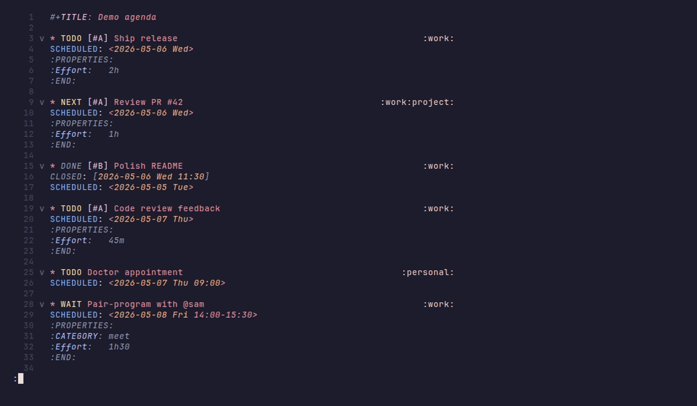

<p align="center">
  
</p>

<h1 align="center">organ.nvim</h1>

<p align="center">
  <strong>Org mode + org‑roam for Neovim.</strong><br>
  Tree‑sitter grammar. SQLite index. Native everything.
</p>

<p align="center">
  <a href="https://github.com/sakakibara/organ.nvim/actions/workflows/test.yml"></a>
  <a href="./LICENSE"></a>
  <a href="https://neovim.io/"></a>
</p>

<p align="center">
  <a href="#why-organnvim">Why</a> ·
  <a href="#demo">Demo</a> ·
  <a href="#install">Install</a> ·
  <a href="#quickstart">Quickstart</a> ·
  <a href="#features">Features</a> ·
  <a href="#commands">Commands</a> ·
  <a href="#configuration">Config</a> ·
  <a href="#native-os-notifications">Notifications</a> ·
  <a href="#differences-from-emacs">vs Emacs</a> ·
  <a href="./CONTRIBUTING.md">Contribute</a>
</p>

---

## Why organ.nvim

A full `org-mode` + `org-roam` reimplementation in Neovim.  Tree-sitter
grammar, SQLite index, native pickers / completion / icons.  Files
written by Emacs read back unchanged, and files written by organ stay
valid Emacs org as long as you don't opt into organ's grammar
extensions (repeater alarm / repeater filter on timestamps).  No
background daemon, no external indexing process — the SQLite index is
updated in-process via a LuaJIT FFI wrapper around libsqlite3.

Built for users who want the org-roam workflow (id-linked notes,
dailies, backlinks) in Neovim **with Emacs file compatibility on
standard syntax** — not a from-scratch reimagining.

## Demo

<p align="center">
  
</p>

More: [capture](assets/demos/capture.gif) ·
[refile](assets/demos/refile.gif) ·
[roam](assets/demos/roam.gif) ·
[babel](assets/demos/babel.gif)

## Install

**Requires** Neovim 0.10+, SQLite 3, and `git` + `make` + a C compiler
to build the tree-sitter grammars.  No Node / npm / pnpm — the grammar
repos (`tree-sitter-organ`, `tree-sitter-organ-inline`) commit the
generated `parser.c`; install clones them and runs `make`.

<details open>
<summary><strong>lazy.nvim</strong></summary>

```lua
{
  "sakakibara/organ.nvim",
  dependencies = {
    "sakakibara/tablature.nvim",
    "sakakibara/narrow.nvim",
  },
  build = function() require("organ.grammar_install").install() end,
  config = function()
    require("organ").setup({
      org_dir = vim.fn.expand("~/org"),
    })
  end,
}
```

</details>

<details>
<summary><strong>vim.pack</strong> (Neovim 0.12+, no third‑party manager)</summary>

```lua
vim.pack.add({
  "https://github.com/sakakibara/tablature.nvim",
  "https://github.com/sakakibara/narrow.nvim",
  "https://github.com/sakakibara/organ.nvim",
})
require("organ.grammar_install").install()  -- one-time, idempotent
require("organ").setup({
  org_dir = vim.fn.expand("~/org"),
})
```

</details>

The build step compiles the grammars into `<stdpath data>/organ/parser/`.
nvim‑treesitter is **not** required.

**Related repositories** (your plugin manager fetches the runtime
deps automatically; `grammar_install` clones the grammars on first
run):

- [tablature.nvim](https://github.com/sakakibara/tablature.nvim) — table editing primitives
- [narrow.nvim](https://github.com/sakakibara/narrow.nvim) — subtree narrowing
- [tree-sitter-organ](https://github.com/sakakibara/tree-sitter-organ) — block-level grammar
- [tree-sitter-organ-inline](https://github.com/sakakibara/tree-sitter-organ-inline) — inline grammar (emphasis, links, timestamps, ...)

## Quickstart

```vim
:Org scan               " index your org_dir into SQLite
:Org agenda             " open the agenda
:Org find               " fuzzy-find headlines
:Org capture            " run a capture template
:Org clock in           " start a clock on the headline at cursor
:Org roam daily today   " open today's daily note
```

All commands are subcommands of a single `:Org` user command. Type
`:Org <Tab>` to see the full list, or `:Org <prefix><Tab>` to filter.

Default global keymaps under `<Leader>o*`:

| Action            | Key            |
|-------------------|----------------|
| Capture           | `<Leader>oc`   |
| Agenda            | `<Leader>oa`   |
| Find              | `<Leader>of`   |
| Find link         | `<Leader>ol`   |
| Roam find/insert  | `<Leader>or`   |
| Daily note        | `<Leader>od`   |
| Clock in / out    | `<Leader>oi` / `<Leader>oo` |

## Features

| Area | What's in it |
|---|---|
| **Core org** | TODO cycling (multi-sequence + annotated keys + fast-selection), LOGBOOK state changes, dependency guards (`:ORDERED:`, parent-blocked-by-children, checkbox), capture, refile, archive, attach, clocking, properties, tag inheritance, footnotes, columns, habits, holidays, inline tasks |
| **Agenda** | Daily / week / todo-list / tags / search / stuck-projects views, time grid + `← now` marker, log-mode (closed / clock / state), entry-text mode, sticky buffers, repeater expansion, `:ORDERED:` / `#+CATEGORY:` respect, bulk select + action menu, vim-native `u` / `<C-r>` undo, sparse trees |
| **Roam** | Nodes (`:ID:` IDs), dailies, backlinks sidebar (tab-local + persistent resize), node-find / link-insert pickers, graph export (DOT + Mermaid), linkify pass |
| **Tables** | Auto-align, row/col ops, sort, CSV/TSV I/O, native pure-Lua Calc-compatible engine: bignum / rational / IEEE float / units / finance / matrix algebra / symbolic deriv-integ-limit |
| **Babel** | Built-in: sh / bash / zsh / fish / python / lua / ruby / perl / js / ts / php / R / scheme.  `:session` header keeps a REPL alive across blocks.  Add more via `babel.languages.<lang> = ...` |
| **Citations** | Native BibTeX + CSL-JSON parsers, APA / Chicago / IEEE styles, completion source (blink.cmp / nvim-cmp), integrated into every export backend |
| **Export** | 8 native backends: markdown / html / latex / beamer / ascii / texinfo / opml / ics.  Multi-project publish pipeline.  No Emacs or pandoc dependency |
| **Authoring** | Macros, `#+SETUPFILE:` / `#+INCLUDE:` expansion, dynamic blocks, modal SRC-block edit, LaTeX fragment rendering |
| **Modern UX** | Per-level bullet glyphs (◉ ○ ◈ ◇), block frames (`┌── lang ──` / `└──`), TODO/timestamp pills, star concealment, link conceal, all opt-in |
| **OS notifications** | macOS / Linux / Windows desktop notifications that fire **even when Neovim is closed**.  Strictly opt-in.  See [Notifications](#native-os-notifications) |
| **Pickers + UI** | Auto-detects snacks → telescope → fzf-lua → `vim.ui.select` (built-in fallback).  Completion: blink.cmp → nvim-cmp → omnifunc.  Icons: mini.icons → nvim-web-devicons |
| **Quality of life** | Pomodoro / countdown timer, profiler (`:Org profile`), refile picker shows breadcrumb path, which-key group labels, LazyVim-style keymap descriptions |

## Commands

<details>
<summary><strong>Index, scan, watcher</strong></summary>

`:Org scan`, `:Org index`, `:Org status`, `:Org watch start`,
`:Org watch stop`, `:Org watch status`
</details>

<details>
<summary><strong>Agenda</strong></summary>

`:Org agenda` (interactive dispatcher with no args; named view via
`:Org agenda <name>`), `:Org agenda custom`, `:Org agenda day`,
`:Org agenda week`, `:Org agenda todos`, `:Org agenda tags [query]`,
`:Org agenda search [query]`, `:Org stuck_projects`

In‑agenda keymaps (vim‑idiomatic, override avoided where possible):
`<CR>`/`gs`/`gv` jump/split/vsplit, `r` refresh, `q` close, `/` filter,
`u`/`<C-r>` undo/redo bulk delete, `<Tab>` fold, `]]`/`[[` next/prev
block, `t`/`T` TODO cycle/set, `+`/`-`/`=` priority raise/lower/clear,
`s`/`D` schedule/deadline, `gT` set tags, `A` archive row, `gA`
show/hide archived, `gC` clock report, `I`/`O` clock in/out, `R`
refile, `<M-CR>` add new entry, `f`/`b` next/prev period, `.` today,
`gj` jump to date, `gd`/`gw` day/week view, `e` effort filter,
`<Space>` bulk mark, `gM` mark all, `gB` bulk action menu, `g?` help.
</details>

<details>
<summary><strong>Pomodoro / countdown timer</strong></summary>

`:Org timer start [duration]` (default 25m; accepts `25`, `25m`, `90s`,
`1h`, `1h30m`, `0:25:00`), `:Org timer stop`, `:Org timer pause`
(toggles), `:Org timer status`. Statusline component:
`require("organ.timer").statusline()` returns `"⏲ 18:42"` /
`"⏸ 18:42"` / `""`.
</details>

<details>
<summary><strong>Profile / instrumentation</strong></summary>

`:Org profile start [slow_ms]` wraps the indexer + agenda hot paths,
`:Org profile stop` prints the report, `:Org profile report` shows
running totals without stopping. Surfaces slow calls (≥ 50 ms by
default) with example inputs.
</details>

<details>
<summary><strong>Capture, refile, archive</strong></summary>

`:Org capture` (template via `:Org capture <key>`), `:Org capture_prompt`,
`:Org refile`, `:Org archive subtree`, `:Org archive to_sibling`
</details>

<details>
<summary><strong>TODO, planning, clock</strong></summary>

`:Org todo`, `:Org schedule`, `:Org deadline`, `:Org toggle_ordered`,
`:Org set_effort`, `:Org clock in`, `:Org clock out`, `:Org clock jump`,
`:Org clock cancel`, `:Org clock report`
</details>

<details>
<summary><strong>Find, links, attach</strong></summary>

`:Org find`, `:Org find file`, `:Org find link`, `:Org find ref`,
`:Org find tag`, `:Org find todo`, `:Org goto`, `:Org follow_link`,
`:Org store_link`, `:Org insert_link`, `:Org id get_create`,
`:Org id update`, `:Org backlinks`, `:Org attach [path]`,
`:Org attach open`, `:Org attach reveal`, `:Org attach screenshot`,
`:Org attach url <url>`
</details>

<details>
<summary><strong>Subtree, structure, properties, tags</strong></summary>

`:Org promote`, `:Org demote`, `:Org promote_headline`,
`:Org demote_headline`, `:Org move_up`, `:Org move_down`,
`:Org cut_subtree`, `:Org copy_subtree`, `:Org paste_subtree`,
`:Org narrow_to_subtree`, `:Org widen`, `:Org set_property`,
`:Org delete_property`, `:Org set_tags`, `:Org columns`
</details>

<details>
<summary><strong>Lists, checkboxes, tables, sparse trees, footnotes</strong></summary>

`:Org toggle_checkbox`, `:Org toggle_item`, `:Org list sort`,
`:Org list repair`, `:Org list to_subtree`, `:Org update_statistics`,
`:Org table sort`, `:Org table_*` (insert/delete/move row/col),
`:Org table eval_formulas`, `:Org table import`, `:Org table export`,
`:Org sparse_tree_*` (`todo` / `tag` / `regex` / `match` / `clear`),
`:Org footnote_*` (`insert` / `jump` / `normalize` / `renumber` / `sort`)
</details>

<details>
<summary><strong>Citations, macros, babel, dynamic blocks</strong></summary>

`:Org cite preview [style]`, `:Org cite bibliography [style]`,
`:Org cite find`, `:Org expand_preview`, `:Org babel execute`,
`:Org babel execute_buffer`, `:Org babel tangle`, `:Org update_dblock`,
`:Org update_all_dblocks`, `:Org edit_special`,
`:Org inline_task_insert`
</details>

<details>
<summary><strong>Export and publish</strong></summary>

`:Org export_*` (`markdown` / `html` / `latex` / `beamer` / `ascii` /
`texinfo` / `opml` / `ics` / `ics_all`), `:Org publish <project>`,
`:Org publish_all`
</details>

<details>
<summary><strong>Roam</strong></summary>

`:Org roam`, `:Org roam insert`, `:Org roam buffer`,
`:Org roam daily today` / `roam_daily_yesterday` / `roam_daily_tomorrow`,
`:Org roam daily [<iso>]`, `:Org roam graph`, `:Org roam graph_mermaid`,
`:Org roam linkify`, `:Org roam linkify_buffer`
</details>

<details>
<summary><strong>LaTeX, images, misc</strong></summary>

`:Org latex_preview`, `:Org latex_render`, `:Org latex_cache_purge`,
`:Org image_reveal`, `:Org toggle_inline_images`, `:Org pretty_entities`,
`:Org conceal toggle`, `:Org complete`, `:Org increment` /
`:Org decrement`, `:Org meta_return`, `:Org indent_mode`, `:Org habits`,
`:Org fetch_holidays`, `:Org protocol`
</details>

## Formatting

Paragraph rewrap that preserves headlines, list bullets, drawers, blocks,
planning lines, and tables. Wraps to `textwidth` (or 80 if unset).

| Trigger | Effect |
|---------|--------|
| `gq` motion (e.g. `gqip`) | Rewrap that paragraph (Vim's `formatexpr` is wired to organ.format). |
| `:Org format` | Rewrap the whole buffer. |
| `:'<,'>Org format` | Rewrap the visual selection. |
| LSP `textDocument/formatting` | Same — `vim.lsp.buf.format()` works out of the box. |

Auto‑format‑on‑save is intentionally not bundled. The organ in‑process
LSP server advertises `documentFormattingProvider` +
`documentRangeFormattingProvider`, so any standard formatter‑runner
drives it:

<details>
<summary><strong>built‑in LSP (no extra plugin)</strong></summary>

```lua
vim.api.nvim_create_autocmd("BufWritePre", {
  pattern = "*.org",
  callback = function() vim.lsp.buf.format({ async = false }) end,
})
```

</details>

<details>
<summary><strong>conform.nvim</strong></summary>

```lua
require("conform").setup({
  formatters_by_ft = { org = { lsp_format = "prefer" } },
  format_on_save = { timeout_ms = 800 },
})
```

</details>

<details>
<summary><strong>direct Lua hook (no LSP, no plugin)</strong></summary>

```lua
vim.api.nvim_create_autocmd("BufWritePre", {
  pattern = "*.org",
  callback = function() require("organ.format").format_buffer(0) end,
})
```

</details>

Programmatic API (Lua):

```lua
require("organ.format").format_buffer(0)        -- format current buffer
require("organ.format").format_range(0, 5, 20)  -- format lines 5–20 (1-based, inclusive)
local out = require("organ.format").format_lines(input_lines, 80)  -- pure
```

## Configuration

`require("organ").setup({...})` — five conventions:

1. **List/map collections REPLACE on user override** (e.g.
   `capture.templates`, `agenda.views`).  Compose with defaults
   explicitly via `require("organ.defaults")`.
2. **Keymap blocks deep-merge** — `keymaps.<name> = "<lhs>"`
   overrides; `false` disables; whole-block `keymaps = false`
   disables them all.
3. **`enabled = true`** at every feature root.
   `<feature>.enabled = false` removes the feature entirely
   (keymaps off, autocmds off, `:Org` subcommands removed).
4. **`nil` is "absent"** — to disable, use `false`.
5. **Defaults are public** — `require("organ.defaults")` is the
   canonical tree; copy + compose.

```lua
require("organ").setup({ property = { enabled = false } })
require("organ").setup({
  structure = { keymaps = { promote_subtree = "<Leader>op" } },
})
require("organ").setup({ global_keymaps = { find = false } })
```

Full surface: `:h organ-config`.

## LSP

organ ships an **in-process LSP server**.  Every org buffer gets
a client attached automatically on `FileType=org` -- no
`vim.lsp.start` boilerplate, no lspconfig entry, no Mason
install.  It's a Lua module, not a separate process.

What it exposes:

- `K` -- hover (headline summary, ID resolution, link target preview)
- `gd` -- go to definition (jump to ID target / footnote / link)
- `gr` -- references (every link pointing at the headline at cursor)
- `<F2>` -- rename (rename a headline + update inbound links)
- `documentSymbol` / `workspace/symbol` -- outline + cross-file find
- `foldingRange`, `documentLink`, `codeAction`, `diagnostic`
- `formatting` -- `vim.lsp.buf.format()` runs `:Org format`

Tools that "just work" via LSP: aerial.nvim, symbols-outline.nvim,
telescope-lsp-*, fzf-lua's `lsp_*` pickers, trouble.nvim,
nvim-navic.

Opt out: `require("organ").setup({ lsp = { enabled = false } })`.

## Native OS notifications

Agenda alarms can fire **even when Neovim is closed**, via the OS
scheduler.  **Strictly opt-in** — nothing is installed, registered,
or scheduled until you enable it.

```lua
require("organ").setup({
  alarms = {
    enabled        = true,
    local_schedule = true,    -- route reminders through the OS
    lookahead_hours = 48,
  },
})
```

| Platform | Scheduler | Delivery |
|---|---|---|
| macOS | LaunchAgent + bundled Swift helper | "Organ"-attributed banner |
| Linux | `at(1)` / `systemd-run --user` | `notify-send` |
| Windows | `Register-ScheduledTask` | WinRT toast |

Commands: `:Org notifier install` / `test` / `status` / `doctor` /
`clear` / `uninstall`.  See `:h organ-notifier` for the install
layout, manual-removal recipes, and platform-specific setup.

## Statuscolumn

Two helpers for users with a custom `'statuscolumn'`:

| Helper | Replaces | Why |
|---|---|---|
| `require("organ.fold").statuscolumn_marker(lnum)` | the `foldlevel(lnum) > foldlevel(lnum-1)` "is this a fold start" idiom | That idiom misses heading lines whose foldlevel doesn't strictly exceed the previous line's (sibling headings at the same depth, or any heading after body in `body_fold = true`).  The helper marks every heading line as a fold-start. |
| `require("organ.fold.contents").statuscolumn_lnum(lnum, relative)` | the value vim feeds into `%l` / `%r` for `'number'` / `'relativenumber'` | Vim counts buffer lines.  Under CONTENTS view body is concealed but its line numbers are still allocated -- a heading 5 buffer rows down with concealed body would render as `5` even though it's visually adjacent.  The helper returns visible-line distance instead. |

Both helpers degrade to vim-equivalent values outside the contexts they care about, so it's safe to wire both unconditionally.  Recipe:

```lua
-- ~/.config/nvim/lua/lib/statuscolumn.lua (or wherever yours lives)
local M = {}

local function number_for(lnum, relnum, virtnum)
  if virtnum and virtnum ~= 0 then return "    " end
  local relative = vim.wo.relativenumber and relnum and relnum ~= 0
  local n
  local ok, contents = pcall(require, "organ.fold.contents")
  if ok and contents.statuscolumn_lnum then
    n = contents.statuscolumn_lnum(lnum, relative)
  else
    n = relative and relnum or lnum
  end
  return string.format("%4d", n)
end

local function fold_for(lnum)
  local ok, organ_fold = pcall(require, "organ.fold")
  if ok and organ_fold.statuscolumn_marker then
    return organ_fold.statuscolumn_marker(lnum)
  end
  -- vim-default fallback if organ isn't loaded
  local fillchars = vim.opt.fillchars:get()
  if vim.fn.foldlevel(lnum) == 0 then return " " end
  if vim.fn.foldclosed(lnum) > 0 then
    return "%#FoldColumn#" .. (fillchars.foldclose or ">") .. "%*"
  elseif vim.fn.foldlevel(lnum) > vim.fn.foldlevel(lnum - 1) then
    return "%#FoldColumn#" .. (fillchars.foldopen or "v") .. "%*"
  end
  return " "
end

function M.render()
  return table.concat({
    "%s",  -- signs
    number_for(vim.v.lnum, vim.v.relnum, vim.v.virtnum),
    " ",
    fold_for(vim.v.lnum),
    " ",
  })
end

return M
```

Then `vim.o.statuscolumn = "%!v:lua.require'lib.statuscolumn'.render()"`.

Vim's built-in `%C` also renders fold markers correctly (it has
direct access to `>N` directives), but adds an indicator on every
line inside an open fold and doesn't help with the relnum-under-conceal
problem, so the helpers stay useful even alongside `%C`.

## Folding

Two strategies, controlled by `fold.body_fold`:

```lua
require("organ").setup({
  fold = { body_fold = false },  -- default
})
```

**`body_fold = false` (default, Emacs-faithful):** body lines share
the parent heading's foldlevel.  Each heading section is one fold;
`za` on body folds the heading.  CONTENTS view (third `<S-Tab>`
state) hides body via `conceal_lines` extmarks, leaving every
heading visible at every depth.  Auto-bumps `conceallevel` and
`concealcursor` while CONTENTS is active and restores both on exit.
Requires Neovim 0.11+ for the `conceal_lines` primitive; on older
Neovim CONTENTS degrades to "level-1 headings only" (`foldlevel=1`).

**`body_fold = true`:** body sits at `body_level = max_heading_depth + 1`
so `:set foldlevel = max_heading_depth` is itself the CONTENTS state.
No conceal dependency -- pick this if you keep `conceallevel = 0`
and don't want the temporary bump.  `za` on body folds the body
line, not the heading.

### CONTENTS view: special-treatment summary

When the third `<S-Tab>` state is active under `body_fold = false`,
several treatments apply for the duration of the mode and are
reverted on exit -- nothing is allowed to persist past the cycle:

- Body line ranges get `conceal_lines = ""` extmarks in the
  `organ_fold_contents` namespace.
- Window `conceallevel` auto-bumps to 2 (if lower) and
  `concealcursor` is set to `nvic` so cursor-on-concealed stays
  hidden.  Saved per-window, restored on exit on every window
  showing the buffer.
- A buffer-local `CursorMoved` autocmd redirects the cursor off
  concealed body to the nearest visible line in the direction of
  travel.  Covers j / k / arrows / gj / gk / search / gg / G / ]]
  / [[ / marks / mouse / any custom mapping -- no user keymap is
  touched.  `BufWinEnter` is included so window switches and tmux
  focus also nudge the cursor off body.
- For correct relnum: vim's built-in `'relativenumber'` counts
  buffer lines, so a 5-row gap of concealed body still shows as
  "5".  Use `require("organ.fold.contents").statuscolumn_lnum(lnum,
  relative)` from a custom statuscolumn to get visible-line
  distance.  Outside CONTENTS the helper degrades to vim-equivalent
  values, so it's safe to wire unconditionally.
- `BufWipeout` and `FileType` (off-org) trigger automatic cleanup
  so state never leaks past the buffer / filetype it was meant for.

## Conceal

Per-element switches under `emphasis`.  Each element can be turned
off independently so users can keep `*bold*` markers visible while
still concealing link brackets, etc.

```lua
require("organ").setup({
  emphasis = {
    enabled = true,           -- bumps conceallevel = 2 on attach
    bold     = true,
    italic   = true,
    underline = true,
    strike   = true,
    verbatim = true,
    code     = true,
    links    = true,          -- [[target][description]] -> description
  },
})
```

Runtime: `:Org conceal toggle` toggles all conceal at once;
`:Org conceal toggle <element>` flips one element and re-applies
marks across loaded org buffers.

## Differences from Emacs

The agenda render mirrors Emacs's defaults (category prefix, `[#A]`
cookies, `Sunday 3 May 2026` headers).  A handful of workflows
intentionally differ — vim-native bindings, structured multi-criteria
filters.  Full list: `:h organ-differences`.

## Contributing

Bug reports, feature requests, and PRs welcome.  See
[`CONTRIBUTING.md`](./CONTRIBUTING.md).

```sh
make test            # bootstrap + build grammar + run suite
make test-only       # tests only (fast iteration)
make lint            # stylua --check
make demos           # rebuild local preview GIFs (preview only)
make help            # all targets
```

Demos in [`assets/tapes/`](./assets/tapes/) are
[VHS](https://github.com/charmbracelet/vhs) `.tape` scripts.  Tapes are
the source of truth; the committed `assets/demos/*.gif` are CI-only
artifacts (`.gitignore`'d locally, force-committed by the workflow).
Edit a tape, push, CI re-renders.  See `make help` for `demos-force` /
`demo-deps`.
